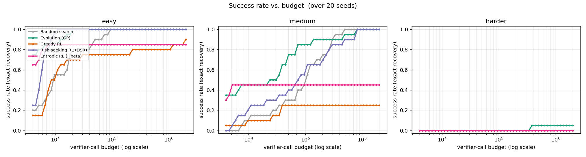
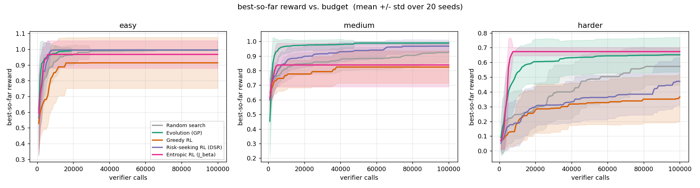
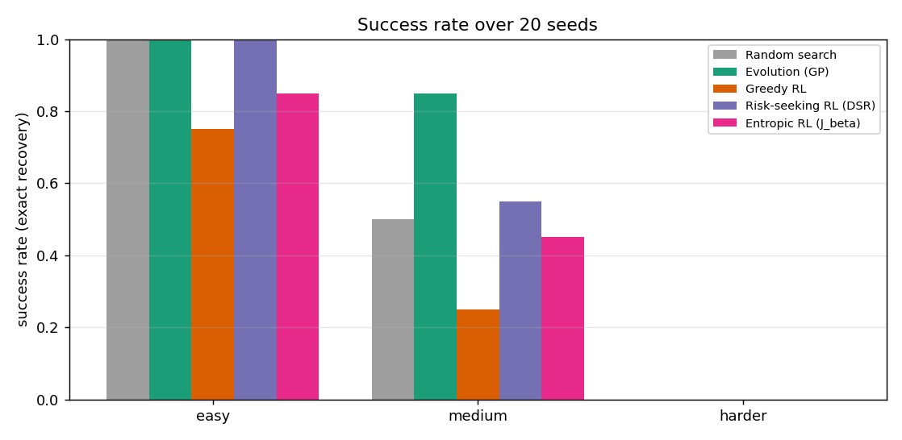
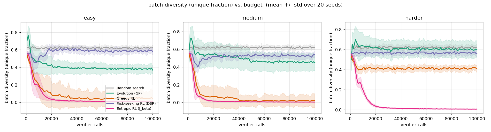

# Self-Improvement Arena — Layer 0

A small, fast, **non-LLM** sandbox for studying optimization dynamics from the
self-improvement / open-ended-search literature
([AlphaEvolve](https://arxiv.org/abs/2506.13131),
[ThetaEvolve](https://arxiv.org/abs/2511.23473),
[TTT-Discover](https://arxiv.org/abs/2601.16175),
[Deep Symbolic Regression](https://arxiv.org/abs/1912.04871)).
Those methods are expensive and LLM-bound,
which makes the *underlying* search dynamics hard to study. Here we reproduce them on
**symbolic regression** — recovering a hidden formula from data — which runs in
seconds-to-minutes on a laptop CPU.

**The hypothesis we set out to test** (folklore from that literature):

> Evolution beats greedy RL; greedy RL mode-collapses to a simple-but-suboptimal
> solution; risk-seeking RL recovers the peak.

**What we actually found** (three results, detailed below):

1. **The greedy collapse is real — and *permanent*.** Greedy RL (and the entropic
   variant) collapse onto one wrong expression and **stay collapsed across 20× more
   budget**. It's a broken *objective*, not a compute shortage.
2. **Evolution stayed the best method here — risk-seeking did *not* overtake it.**
   DSR-style risk-seeking matches evolution's *ceiling* (both solve the solvable
   targets) but is ~2.5× less sample-efficient. This is the *opposite* of DSR's
   paper ranking, and we explain why it's benchmark-specific (and not a contradiction).
3. **For risk-seeking, the objective's *shape* matters more than its temperature.**
   The hard top-ε quantile (DSR) is robustly collapse-resistant; the soft entropic
   tilt (`J_β`) collapses across its *entire* β range and under both ESS- and
   KL-adaptive schedules.

Layer 1 (see [`layer1/`](layer1/)) swaps in an LLM proposer behind the *same*
interfaces to test whether any of this transfers. All three arms are implemented —
program-database evolution (in-context) plus greedy and risk-seeking **LoRA**
fine-tuning, which reuse Layer 0's exact reward-weighting via the shared
[`objectives.py`](src/sia/objectives.py). The LoRA arms need Apple Silicon (MLX)
and have not yet been run end-to-end on-device; see
[`layer1/README.md`](layer1/README.md) for the M4 verification steps.

---

## The research question

Three method families compete on the **same task**, with the **same verifier**,
under the **same budget** (counted in *verifier calls*, so the comparison is fair).
Only the *proposer* changes:

1. **Evolution** — genetic programming (population-based search).
2. **Greedy RL** — a policy trained to maximize **expected** reward (standard REINFORCE).
3. **Risk-seeking / entropic RL** — the **same** policy trained to maximize the
   **best** outcomes, not the average.

## The setup (the seams)

Everything is built around three interfaces so that Layer 0 (search/RL) and Layer 1
(LLM) can share the task, the reward, and the metrics — only the proposer differs.

- **Task** ([`task.py`](src/sia/task.py)) — a hidden target function sampled into
  `(x, y)` data plus a held-out set, and the expression grammar (variables `{x}`,
  constants `{1, 2, 0.5}`, unary `{sin, cos}`, binary `{+, −, ×, ÷}`). Three targets
  of increasing difficulty, all reachable from the grammar:
  - `easy`: `x² + 1`
  - `medium`: `x² + sin(x)`  ← the main running example
  - `harder`: `x³ − x + cos(2x)`
- **Verifier** ([`verifier.py`](src/sia/verifier.py)) — the single fixed reward:
  `reward = 1/(1 + MSE_train) − length_penalty · complexity`; invalid expressions
  (div-by-zero, NaN, overflow) score 0. Microsecond-fast and it **counts its own
  calls**. Success = held-out MSE `< 1e-6` (recovering the function, not fitting the
  training x's).
- **Proposer** ([`proposers/base.py`](src/sia/proposers/base.py)) — the only thing
  that changes between methods. A simple `ask()` (propose a batch) / `tell()` (learn
  from rewards) contract. The [`runner`](src/sia/runner.py) drives the loop and
  stops at the shared budget.

### Metrics glossary

- **success rate** — fraction of seeds that recovered the formula (held-out MSE `< 1e-6`).
- **evals-to-solve** — how many verifier calls until that first success (sample-efficiency).
- **best reward** — best `1/(1+MSE)` found (a soft "how close did it get" for unsolved runs).
- **batch diversity** — fraction of *distinct* expressions in a batch; drops to ~0 on collapse.
- **policy entropy** — Shannon entropy of the policy's token choices; ~0 means deterministic.

## The methods, in one line each

- **Random search** — sample fresh random expression trees forever; never learn. Baseline.
- **Evolution (GP)** — keep a population; make children by **subtree crossover/mutation**
  + tournament selection + elitism + a few random immigrants. Searches directly in
  expression-space ([`genetic.py`](src/sia/proposers/genetic.py)).
- **CVaR / Greedy / Risk-seeking / Entropic RL** — a tiny RNN emits expression tokens;
  trained by policy gradient. They differ *only* in how rewards become gradient weights
  (next section).

## The RL objectives — one gradient, a whole risk spectrum

The RL arms are written by hand in numpy ([`policy.py`](src/sia/policy.py)) to make
this concrete. A policy-gradient update is **always**

```
maximize   Σ_i  w_i · Σ_t log π(a_t^i)        +        λ · H(π)
           └──── advantage-weighted log-prob ────┘     └ entropy bonus ┘
```

and **the arms differ only in the per-trajectory weight `w_i`** — pure scalar
arithmetic on the rewards ([`objectives.py`](src/sia/objectives.py), shared with the
Layer 1 LoRA arms). Backprop is identical. Reading the spectrum from risk-averse to
risk-seeking:

| arm | objective (what it maximizes) | weight `w_i` | intuition |
|---|---|---|---|
| **Risk-averse CVaR** | the *lower* `ε` reward tail `E[R \| R≤R̃_ε]` | `(R_i − R̃_ε)` for the bottom ε (so `≤ 0`), else `0` | "lift the *worst* case" → pushes away from bad samples → wrong target for discovery |
| **Greedy** | `E[R]` — the *average* sample | `R_i − mean(R)` | "make the typical sample better" → piles mass on one safe mode → **collapses** |
| **Entropic (`J_β`)** | `(1/β) log E[e^{βR}]` | `∝ e^{βR_i}` (centered) | soft risk-seeking; `β→0` = greedy, `β→∞` = pure max |
| **Risk-seeking (DSR)** | the *upper* `(1−ε)` reward tail `E[R \| R≥R̃_ε]` | `(R_i − R̃_ε)` for the top ε, else `0` | "make the top 10% better, ignore the rest" → reinforces a *set* of good expressions → stays diverse |

The **CVaR and DSR arms are exact mirrors**: the same conditional-tail-expectation
policy gradient (Tamar et al. 2014), one on the *worst* ε-tail (risk-averse), one on
the *best* ε-tail (risk-seeking). DSR is literally that CVaR gradient inverted — see
the lineage note below. Optimizing the *average* sample (greedy) is already the wrong
target for discovery: you do not want a typically-decent expression, you want the
*one* exact hit. Risk-aversion (CVaR) is wronger still — it spends the gradient
making the *worst* samples less bad.

Optimizing the *average* sample (greedy) is the wrong target for discovery: you do
not want a typically-decent expression, you want the *one* exact hit. That pressure
is what collapses the greedy policy onto a simple, safe, wrong attractor.

### Two different things both called "entropy" (don't conflate them)

- **Entropy *bonus*** `λ·H(π)` — a regularizer added to **all** arms equally
  (`λ = 0.01`) that rewards the policy for keeping its token choices *spread out*
  (classic exploration). Note: even *with* it, greedy still collapses — `λ=0.01`
  isn't enough to overcome the `E[R]` collapse pressure.
- **Entropic *objective*** `J_β` — a *risk-seeking reward transformation* (the `w_i`
  above). Only the entropic arm uses it. Same word, unrelated mechanism.

### The quantile advantage and DSR

For the quantile arm the baseline is the **cutoff itself** — `R̃_ε`, the reward at
the `(1−ε)` quantile (the *worst of the kept top-ε*) — not the batch mean, and
sub-cutoff samples are dropped entirely. That is exactly DSR's risk-seeking gradient
([Petersen et al. 2021](https://arxiv.org/abs/1912.04871)); we differ only by a
normalization constant (`1/N` vs DSR's `1/εN`) that folds into the learning rate.

### How `β` is chosen for the entropic arm (`beta_rule`)

- `fixed` — constant tilt, scale-normalized: `β/std(R)`
  ([Jiang et al. 2025](https://arxiv.org/abs/2509.24261) use a constant β).
- `ess` — pick β each batch so the exponential weights keep a target **effective
  sample size** (a standard importance-sampling self-tuning rule).
- `kl` — pick β so the induced (reward-tilted) distribution sits a target **KL** away
  from the batch sampling distribution. This is our reading of
  [**TTT-Discover's**](https://arxiv.org/abs/2601.16175) adaptive β — they "set β(s)
  adaptively per state by constraining the KL divergence of the induced policy." (Our
  exact KL functional may differ from their Appendix A.1.)

---

## Results

### Finding 1 — The greedy collapse is real, and it's *permanent*

Headline run (20 seeds, **100k** verifier calls, `configs/layer0.yaml`):

| target | method | success rate | median evals-to-solve | mean best reward |
|---|---|---|---|---|
| easy | Random search | 1.00 | 9,300 | 0.9944 |
| easy | Evolution (GP) | 1.00 | 1,700 | 0.9945 |
| easy | Greedy RL | 0.75 | 7,400 | 0.9134 |
| easy | Risk-seeking RL (DSR) | 1.00 | 5,500 | 0.9950 |
| easy | Entropic RL (J_β) | 0.85 | 3,000 | 0.9669 |
| medium | Random search | 0.50 | 37,000 | 0.9290 |
| medium | Evolution (GP) | **0.85** | 7,200 | **0.9890** |
| medium | Greedy RL | **0.25** | 24,000 | **0.8242** |
| medium | Risk-seeking RL (DSR) | 0.55 | 19,400 | 0.9675 |
| medium | Entropic RL (J_β) | 0.45 | 3,200 | 0.8386 |
| harder | Random search | 0.00 | – | 0.5728 |
| harder | Evolution (GP) | 0.00 | – | 0.6520 |
| harder | Greedy RL | 0.00 | – | 0.3659 |
| harder | Risk-seeking RL (DSR) | 0.00 | – | 0.4718 |
| harder | Entropic RL (J_β) | 0.00 | – | 0.6735 |

On `medium`, **greedy RL collapses *below* random search** (0.25 vs 0.50; best 0.824
vs 0.929). Its batch diversity crashes toward zero within a few thousand calls and
never recovers — it commits to one simple, wrong attractor. Greedy is the **worst
method on every target**.

The **budget-scaling sweep** (20 seeds, up to **2,000,000** calls = 10,000 gradient
steps, `configs/scaling.yaml`) shows the collapse is not a compute problem:

Success rate vs. budget, `medium`:

| method | 100k | 200k | 500k | 1M | 2M |
|---|---|---|---|---|---|
| Evolution (GP) | 0.85 | 0.90 | 0.95 | 1.00 | 1.00 |
| Risk-seeking (DSR) | 0.55 | 0.70 | 0.90 | 1.00 | 1.00 |
| Random search | 0.50 | 0.75 | 1.00 | 1.00 | 1.00 |
| **Greedy RL** | 0.25 | 0.25 | 0.25 | 0.25 | 0.25 |
| **Entropic RL (J_β)** | 0.45 | 0.45 | 0.45 | 0.45 | 0.45 |



Greedy and entropic are **ruler-flat across 20× more compute**, while GP, DSR, and
even random keep climbing to 1.00. **You cannot buy your way out of a collapsed
objective with more samples.** This is a cleaner statement of the original thesis
than any single-budget snapshot: the collapse is a property of the objective.

### Finding 2 — Evolution stayed best; risk-seeking matched the ceiling but not the efficiency

At 2M calls on `medium`, GP, DSR risk-seeking, and random *all* reach 100% success —
but their **sample-efficiency** differs sharply (median evals-to-solve):

| method | success @2M | median evals-to-solve |
|---|---|---|
| Evolution (GP) | 1.00 | **27,400** |
| Risk-seeking (DSR) | 1.00 | 69,900 |
| Random search | 1.00 | 103,000 |

So **DSR risk-seeking did *not* overtake evolution** — it converged to the same
ceiling ~2.5× slower. (It does beat random, 70k vs 103k, so the learned policy adds
real value; GP's recombination just adds more.) This is the *opposite* of
[DSR's paper](https://arxiv.org/abs/1912.04871), where the learned policy beats GP.
**Why — and why it's not a contradiction:**

- **Tiny, compositional, single-variable space.** Subtree crossover is a near-ideal
  operator here: once `x*x` and `sin(x)` exist in the population, one crossover yields
  `x*x + sin(x)`. The RNN must *learn* to emit that token sequence via gradients —
  same destination, slower route. Direct recombination in solution-space beats
  amortized search in parameter-space when the space is small and compositional.
- **We neutralized what makes DSR shine.** DSR's edge over GP was on larger suites
  (Nguyen) *with constant optimization and bigger token libraries*. We use fixed
  constant tokens, one variable, six operators.
- **The tell: random also hits 100% on `medium`.** When a problem is solvable by
  guided random sampling, a learned prior's main value (generalizing structure across
  a huge space) is moot. DSR's home turf is exactly where nobody solves it yet —
  `harder` (random 0.00, GP only 1/20). We never entered that regime.

### Finding 3 — For risk-seeking, the objective's *shape* beats its temperature

Why does the **quantile** avoid collapse while the **entropic** tilt doesn't? We
swept β over two orders of magnitude *and* both adaptive rules (`medium`, 8 seeds, 200k):

| variant | success | best reward | policy entropy |
|---|---|---|---|
| entropic, fixed β=0.5 | 3/8 | 0.858 | 0.00 |
| entropic, fixed β=1 | 3/8 | 0.833 | 0.00 |
| entropic, fixed β=2 | 4/8 | 0.848 | 0.00 |
| entropic, fixed β=4 | 3/8 | 0.820 | 0.00 |
| entropic, fixed β=8 | 2/8 | 0.782 | 0.00 |
| entropic, ESS-adaptive (0.3) | 3/8 | 0.855 | 0.03 |
| entropic, KL-adaptive (0.5) | 0/8 | 0.772 | 0.03 |
| entropic, KL-adaptive (1.0) | 2/8 | 0.786 | 0.03 |
| entropic, KL-adaptive (2.0) | 2/8 | 0.817 | 0.00 |
| **quantile (DSR)** | **7/8** | **0.989** | **2.10** |

**Every entropic configuration collapses** (policy entropy ~0, success ≤ 4/8); the
quantile sits in a totally different regime (entropy 2.10, 7/8). Fixed β has only a
faint sweet spot at β≈2, degrading both ways (large β → collapses onto the single
best; small β → approaches greedy). **Neither adaptive rule rescues it** — the KL
rule is even worse, and at KL=2.0 you can watch β run away (~2M) chasing the target
once the batch has already collapsed.

**The mechanism:** the exponential weight `e^{βR_i}` always pulls hardest toward the
*single* highest-reward sample, at *every* temperature — so it always carries a
collapse-inducing gradient. The quantile's flat-top weighting (equal gradient across
the whole top-ε, zero below) is the only thing that reinforces a *diverse set* of good
expressions. The shape, not the temperature, is what matters.

One escape hatch: a **strong entropy bonus** (`λ=0.2`, 20× the default) partially
rescues the entropic arm (5/8) — so the collapse is overcome-able by injecting heavy
external exploration, just not by tuning β.





---

## The CVaR ↔ DSR ↔ Jiang ↔ TTT-Discover lineage note

> The same insight — *optimize the best outcomes, not the average* — keeps getting
> rediscovered across RL sub-communities, each time bolted onto whatever
> policy-gradient method is current: vanilla REINFORCE (DSR, 2021, hard quantile) →
> GRPO (RS-GRPO, 2025, soft entropic). The risk measure and the RL backbone both
> change, but the move away from `E[R]` is the through-line — and it traces back to
> risk-sensitive control in the 1970s.

This sandbox's risk-seeking quantile arm **is** essentially
[Deep Symbolic Regression](https://arxiv.org/abs/1912.04871) (Petersen et al., 2021):
an RNN emits expression tokens, trained with a risk-seeking policy gradient on the
top-ε reward quantile. DSR made the "optimize the best, not the average" point for
symbolic regression in **2021**.

DSR's gradient did not come from nowhere — it is the **risk-averse CVaR policy
gradient, inverted**. The conditional-value-at-risk policy gradient was derived for
the *worst*-case ε-tail (risk-averse, for safety/robustness) by
[**Tamar, Glassner & Mannor (2014)**](https://arxiv.org/abs/1404.3862) ("Policy
Gradients Beyond Expectations: Conditional Value-at-Risk"), and applied across a
model ensemble for robust control by [**EPOpt** (Rajeswaran et al., 2016)](https://arxiv.org/abs/1610.01283).
DSR takes that exact `(R_i − R̃_ε)·1[tail]` estimator and flips it from the lower
tail to the upper `(1−ε)` tail — risk-*seeking* instead of risk-*averse*. Our
[`cvar`](src/sia/objectives.py) arm is the original lower-tail objective, included as
the deliberately wrong-direction baseline; `risk` (DSR) is its mirror.

The entropic line rediscovered the same idea in *soft* form:

- [**Jiang et al. (2025)**](https://arxiv.org/abs/2509.24261) put the entropic
  objective `J_β = (1/β) log E[e^{βR}]` (constant β) inside **GRPO** — so vs DSR both
  the *risk measure* (soft exponential tilt, not a hard quantile) **and** the *RL
  backbone* (GRPO, not vanilla REINFORCE) differ. Jiang **does** trace the entropic
  objective to the classic **exponential-utility / risk-sensitive control** criterion
  (Howard & Matheson, 1972), so the *entropic* lineage is properly credited.
- [**TTT-Discover (2026)**](https://arxiv.org/abs/2601.16175) uses `J_β` with an
  **adaptive β** (KL-constrained), and cites Jiang et al. for the objective — calling
  it concurrent work.
- **The gap is *across threads*, not within them.** The *entropic* thread
  (Howard-Matheson → Jiang → TTT) and the *quantile/CVaR* thread (Tamar → DSR) are each
  well-traced internally, but **neither cites the other** — even though they're the
  same "optimize the tail, not the mean" idea reached from two directions (soft
  exponential tilt vs hard quantile). Neither entropic paper cites DSR.
- **The quantile thread also reaches GRPO.**
  [**RiskPO (2025)**](https://arxiv.org/abs/2510.00911) is the *quantile/VaR* mirror of
  Jiang's *entropic* move: it swaps GRPO's mean advantage for a **Mixed Value-at-Risk**
  objective — a fixed-coefficient blend of two quantile regions (defaults α=0.2, β=0.8,
  ω=0.5), with the quantile thresholds estimated online and only the policy trained (no
  learned weighting). It targets the same entropy-collapse failure we see in greedy RL.
  It is, in effect, RiskPO ≈ a weighted combination of this sandbox's
  [`risk`/`cvar`](src/sia/objectives.py) arms at several ε levels — plus a *bundling*
  trick (risk taken over sums of several questions' rewards, to give the quantile
  estimator a richer distribution). We don't implement the blend here — the single-cut
  `risk` arm already makes the point — but RiskPO is the natural GRPO-era endpoint of
  the quantile line, just as Jiang is for the entropic line.

Yet the hard top-ε quantile is essentially a limiting case of the soft exponential
tilt — both abandon expected reward for the same reason. The 2021 → 2025 gap with no
cross-citation is a small but telling example of the same optimization insight being
rediscovered across sub-communities (RL for program search vs. test-time LLM
training). Our Finding 3 adds a wrinkle: in this setting the two are *not*
interchangeable — the hard quantile is markedly more collapse-resistant than the soft
tilt.

### Aside: two "normalizations" that sound alike but aren't (and which we use)

Reading the GRPO-lineage papers, two different things both get called *normalization*,
and it's easy to conflate them:

1. **GRPO advantage std-normalization** — GRPO divides the advantage by the spread of
   rewards *within a prompt's group*: `A_i = (R_i − mean) / std`. [**Dr.GRPO** (Liu et
   al., 2025)](https://arxiv.org/abs/2503.20783) showed that `/std` introduces a
   *question-difficulty bias* (low-variance prompts get their gradient amplified), and
   that GRPO's per-response length-averaging adds a *length bias*. Both are removed in
   "GRPO done right"; Jiang's RS-GRPO follows suit.
2. **NRMSE reward normalization** (ours, optional) — divides the *error* by the spread
   of the *target values* `std(y)` to make the **reward** scale-invariant across tasks.
   This is reward *shaping*, on a different axis entirely from the advantage estimator.

These are orthogonal: one normalizes the **advantage** by reward-spread-within-a-prompt;
the other normalizes the **reward** by target-spread-within-a-task. Worth flagging
because our LoRA arms already sit on the Dr.GRPO side of (1): the advantage is plain
`R_i − mean(R)` with **no `/std`**, and the loss **sums** over completion tokens rather
than length-averaging (`(ce·mask).sum()`), so it dodges *both* GRPO biases by
construction — while NRMSE (2) remains a separate, opt-in reward-shaping knob.

---

## How to run

```bash
pip install -e .                                      # Layer 0 (numpy only)
python run_layer0.py --quick                          # fast smoke run -> results_quick/
python run_layer0.py --config configs/layer0.yaml     # headline run, 20 seeds, 100k -> results/
./run_overnight.sh                                    # budget-scaling sweep, 2M calls -> results_scaling/
PYTHONPATH=src python -m tests.test_core              # sanity checks
PYTHONPATH=src python -m tests.test_objectives        # shared RL objectives (numeric)
PYTHONPATH=src:. python -m tests.test_layer1          # Layer 1 LoRA ask/tell (no MLX)
PYTHONPATH=src:. python -m tests.test_app_engine      # Streamlit engine (no Streamlit/MLX)
```

Dependencies are declared in [`pyproject.toml`](pyproject.toml) as a tiny numpy
core plus two optional extras (composable for what your machine supports):

```bash
pip install -e .                  # Layer 0: search + RL, runs anywhere
pip install -e ".[app]"           # + the interactive Streamlit visualizer
pip install -e ".[app,layer1]"    # + the LLM/LoRA arms (Apple Silicon only)
```

### Interactive visualizer

```bash
pip install -e ".[app]"
streamlit run streamlit_app.py
```

Step the methods batch-by-batch on the same task and watch the dynamics the
offline figures only summarize: best-so-far reward, the greedy **collapse** (batch
diversity / policy entropy crashing toward 0), and whether the current best
expression actually fits the data. The Layer 1 (LLM/LoRA) panel activates only on
Apple Silicon (where `mlx-lm` imports) and otherwise shows a clear "not available
here" note — everything else works on any platform. The stepping logic lives in
[`app_engine.py`](app_engine.py) (no Streamlit import, so it is unit-tested
separately); [`streamlit_app.py`](streamlit_app.py) is just the view.

- Everything is seeded and configured from YAML (budget, seeds, all hyperparameters).
- The scaling sweep is **crash-safe and resumable**: each run is checkpointed to disk
  the instant it finishes; re-running the same command skips completed runs. See
  [`run_overnight.sh`](run_overnight.sh).
- To compare risk-seeking variants, set `mode` / `beta_rule` on the `risk` proposer:
  `mode: quantile` (DSR), or `mode: entropic` with `beta_rule: fixed | ess | kl`
  (see [`configs/layer0.yaml`](configs/layer0.yaml)).

## Repo layout

```
pyproject.toml       deps: numpy core + optional [app] (streamlit) / [layer1] (mlx-lm)
src/sia/
  expression.py      grammar, tree eval, complexity, prefix tokens, GP operators
  task.py            benchmark targets + data generation
  verifier.py        the fixed reward + success check + call counting
  policy.py          numpy vanilla-RNN token policy + manual BPTT (shared by RL arms)
  objectives.py      shared reward->weight formulas (greedy/quantile/entropic), used
                     by BOTH Layer 0 RL proposers and Layer 1 LoRA arms
  proposers/         random, gp, greedy, risk  (the pluggable part)
  runner.py          fair-budget ask/tell loop, multi-seed, resumable checkpointing
  metrics.py         best-so-far, success rate, diversity, scaling, cross-seed aggregation
  plotting.py        figures (curves, success, diversity, budget-scaling) + tables
configs/
  layer0.yaml        headline run (single source of truth)
  scaling.yaml       budget-scaling sweep (2M calls)
  layer1.yaml        Layer 1 LLM-evolution sweep
  layer1_lora.yaml   Layer 1 three-arm sweep (evolution + greedy/risk LoRA)
run_layer0.py        one command -> all figures + tables
run_layer1.py        Layer 1 entrypoint: evolution / greedy_lora / risk_lora arms
run_overnight.sh     crash-safe resumable launcher for the sweeps
app_engine.py        steppable engine behind the visualizer (no Streamlit/MLX import)
streamlit_app.py     interactive visualizer (Layer 0 always; Layer 1 on Apple Silicon)
tests/test_core.py        grammar round-trips, exact-target reward, call counting
tests/test_objectives.py  numeric checks for the shared RL objectives (incl. CVaR)
tests/test_layer1.py      LoRA proposer ask/tell/budget (fake model, no MLX)
tests/test_app_engine.py  visualizer engine: build/step/record + plot data (no Streamlit)
layer1/              LLM proposers: evolution (built) + greedy/risk LoRA (built;
                     needs M4 verification). See layer1/README.md
results/             headline figures + tables (committed); raw logs (gitignored)
results_scaling/     scaling figures + tables (committed); raw logs (gitignored)
```

## Honesty / caveats

- Results are over 20 seeds with error bands (the β-sweep is 8). A single lucky run
  proves nothing; nothing here was tuned until the story fit.
- **Random search is a strong baseline** on this tiny grammar; the load-bearing
  signal is the *ordering* (greedy collapsing below random; risk-seeking and evolution
  above it), not the absolute numbers.
- **GP > DSR here is benchmark-specific and does *not* refute DSR's paper** — DSR
  matches the ceiling, just less efficiently, and our setup lacks the conditions
  (large structured space, constant optimization, random-infeasibility) under which a
  learned prior beats direct recombination.
- The entropic-collapse and adaptive-β findings are in the **small-RNN / tiny-grammar
  / weak-entropy-bonus** regime. An LLM's strong pretrained prior may not collapse at
  all — which would flip the comparison. That is precisely the **Layer-1 transfer
  question**. Our `kl` β-rule is an interpretation of TTT-Discover's adaptive β, not
  their exact functional.
- `harder` (`x³ − x + cos(2x)`) is genuinely hard for exact recovery at this budget;
  treat it as a best-reward comparison, not a solved task.
- The budget is enforced as "stop once `verifier.calls ≥ budget`," so methods may
  overshoot by at most one batch — negligible and equal across methods.

## References

- **Risk-Sensitive Markov Decision Processes** — Howard & Matheson, *Management
  Science*, 1972. The exponential-utility / entropic objective `(1/β) log E[e^{βR}]` —
  the original "optimize the tail, not the mean" criterion underlying the modern
  risk-seeking objectives (and cited as such by Jiang et al.).
- **Deep Symbolic Regression** — Petersen et al., ICLR 2021. Risk-seeking policy
  gradient for symbolic regression. [arXiv:1912.04871](https://arxiv.org/abs/1912.04871)
- **Policy Gradients Beyond Expectations: Conditional Value-at-Risk** — Tamar,
  Glassner & Mannor, 2014. The CVaR policy gradient as a conditional tail expectation
  — the risk-averse objective DSR inverts. [arXiv:1404.3862](https://arxiv.org/abs/1404.3862)
- **EPOpt: Learning Robust Neural Network Policies Using Model Ensembles** —
  Rajeswaran et al., 2016 (ICLR 2017). CVaR over a model ensemble for robust (risk-
  averse) policies. [arXiv:1610.01283](https://arxiv.org/abs/1610.01283)
- **Regularized Evolution for Image Classifier Architecture Search** — Real et al.,
  AAAI 2019. Evolution competitive with / faster than RL on a verifiable reward.
  [arXiv:1802.01548](https://arxiv.org/abs/1802.01548)
- **DeepSeekMath (GRPO)** — Shao et al., 2024. Group Relative Policy Optimization;
  the k3 KL-to-reference estimator our LoRA trust region copies.
  [arXiv:2402.03300](https://arxiv.org/abs/2402.03300)
- **Understanding R1-Zero-Like Training (Dr.GRPO)** — Liu et al., 2025. Identifies
  GRPO's advantage std-normalization (difficulty bias) and length-normalization bias;
  removes both. [arXiv:2503.20783](https://arxiv.org/abs/2503.20783)
- **Risk-Sensitive RL for Alleviating Exploration Dilemmas in LLMs** — Jiang et al.,
  2025. Entropic objective `J_β` (constant β); RS-GRPO. (Cited by TTT-Discover as
  concurrent work.) [arXiv:2509.24261](https://arxiv.org/abs/2509.24261)
- **TTT-Discover** — 2026. Test-time training with the entropic objective `J_β` and
  KL-adaptive β. [arXiv:2601.16175](https://arxiv.org/abs/2601.16175)
- **RiskPO: Risk-based Policy Optimization via Verifiable Reward** — 2025. Swaps GRPO's
  mean advantage for a Mixed Value-at-Risk (multi-quantile) objective to alleviate
  entropy collapse — the quantile/VaR mirror of Jiang's entropic move.
  [arXiv:2510.00911](https://arxiv.org/abs/2510.00911)
- **AlphaEvolve** — Novikov et al., 2025. LLM evolutionary coding agent for algorithm
  discovery. [arXiv:2506.13131](https://arxiv.org/abs/2506.13131)
- **ThetaEvolve** — 2025. LLM program-database evolution; relevant for Layer 1.
  [arXiv:2511.23473](https://arxiv.org/abs/2511.23473)
```
