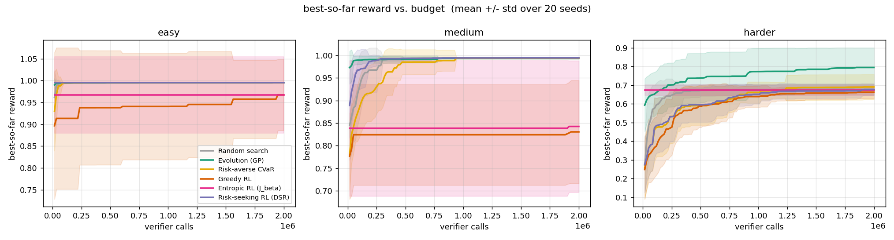
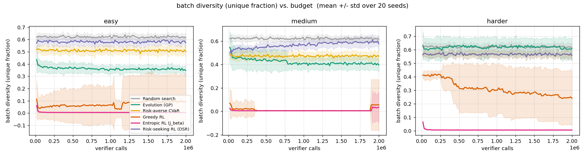
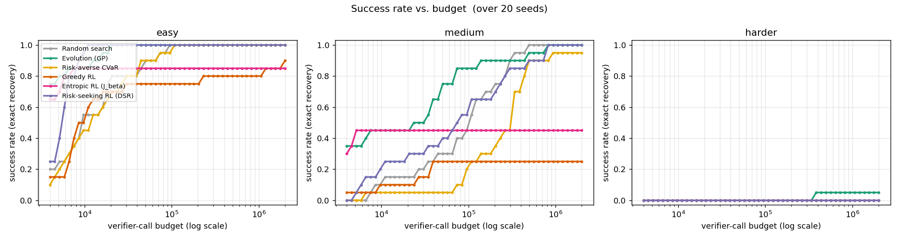

# Layer 0 results — reward = `mse`

Same task, same verifier, same budget (2M verifier calls); only the proposer differs. Mean over 20 seeds.

## Best-so-far reward vs. budget

## Batch diversity — the collapse, visualized

## Success rate vs. budget

## Summary (at full budget)

| target | method | success rate | median evals-to-solve | mean best reward |
|---|---|---|---|---|
| easy | Random search | 1.00 | 9300 | 0.9950 |
| easy | Evolution (GP) | 1.00 | 1700 | 0.9950 |
| easy | Risk-averse CVaR | 1.00 | 12100 | 0.9950 |
| easy | Greedy RL | 0.90 | 8300 | 0.9674 |
| easy | Entropic RL (J_beta) | 0.85 | 3000 | 0.9669 |
| easy | Risk-seeking RL (DSR) | 1.00 | 5500 | 0.9950 |
| medium | Random search | 1.00 | 103000 | 0.9939 |
| medium | Evolution (GP) | 1.00 | 27400 | 0.9932 |
| medium | Risk-averse CVaR | 0.95 | 301400 | 0.9936 |
| medium | Greedy RL | 0.25 | 24000 | 0.8306 |
| medium | Entropic RL (J_beta) | 0.45 | 3200 | 0.8426 |
| medium | Risk-seeking RL (DSR) | 1.00 | 69900 | 0.9939 |
| harder | Random search | 0.00 | - | 0.6776 |
| harder | Evolution (GP) | 0.05 | 375000 | 0.7844 |
| harder | Risk-averse CVaR | 0.00 | - | 0.6893 |
| harder | Greedy RL | 0.00 | - | 0.6552 |
| harder | Entropic RL (J_beta) | 0.00 | - | 0.6735 |
| harder | Risk-seeking RL (DSR) | 0.10 | 550800 | 0.7229 |

## Success rate at increasing verifier-call budgets

| target | method | 100k | 200k | 500k | 1M | 2M |
|---|---|---|---|---|---|---|
| easy | Random search | 1.00 | 1.00 | 1.00 | 1.00 | 1.00 |
| easy | Evolution (GP) | 1.00 | 1.00 | 1.00 | 1.00 | 1.00 |
| easy | Risk-averse CVaR | 1.00 | 1.00 | 1.00 | 1.00 | 1.00 |
| easy | Greedy RL | 0.75 | 0.75 | 0.80 | 0.80 | 0.90 |
| easy | Entropic RL (J_beta) | 0.85 | 0.85 | 0.85 | 0.85 | 0.85 |
| easy | Risk-seeking RL (DSR) | 1.00 | 1.00 | 1.00 | 1.00 | 1.00 |
| medium | Random search | 0.50 | 0.75 | 1.00 | 1.00 | 1.00 |
| medium | Evolution (GP) | 0.85 | 0.90 | 0.95 | 1.00 | 1.00 |
| medium | Risk-averse CVaR | 0.20 | 0.35 | 0.90 | 0.95 | 0.95 |
| medium | Greedy RL | 0.25 | 0.25 | 0.25 | 0.25 | 0.25 |
| medium | Entropic RL (J_beta) | 0.45 | 0.45 | 0.45 | 0.45 | 0.45 |
| medium | Risk-seeking RL (DSR) | 0.55 | 0.70 | 0.90 | 1.00 | 1.00 |
| harder | Random search | 0.00 | 0.00 | 0.00 | 0.00 | 0.00 |
| harder | Evolution (GP) | 0.00 | 0.00 | 0.05 | 0.05 | 0.05 |
| harder | Risk-averse CVaR | 0.00 | 0.00 | 0.00 | 0.00 | 0.00 |
| harder | Greedy RL | 0.00 | 0.00 | 0.00 | 0.00 | 0.00 |
| harder | Entropic RL (J_beta) | 0.00 | 0.00 | 0.00 | 0.00 | 0.00 |
| harder | Risk-seeking RL (DSR) | 0.00 | 0.00 | 0.05 | 0.10 | 0.10 |

> **Note (post-fix).** The `harder` rows are from the re-run after the risk-gradient
> normalization fix (the `1/(εN)` scale); before the fix, risk-seeking spuriously read 0.00 on
> `harder`. The fix only affects the risk-seeking / CVaR arms; the `easy` and `medium` rows are
> from the pre-fix run (those targets are already at/near ceiling for every arm and are unchanged
> in practice). A fully consistent single-run sweep of all three targets is queued.
