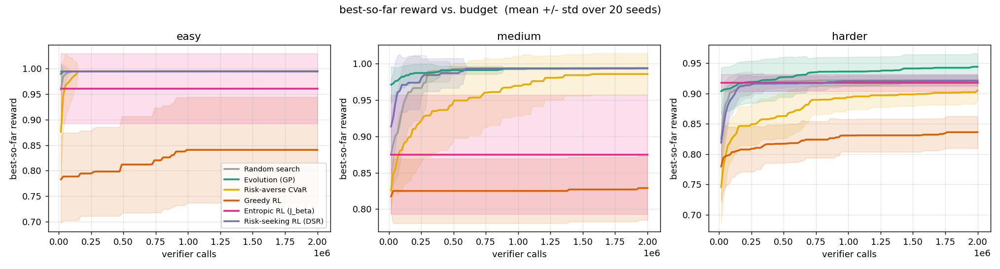
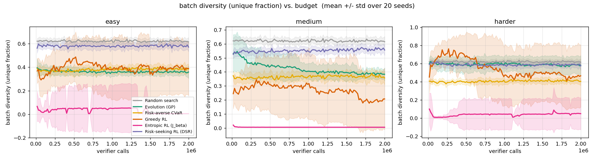
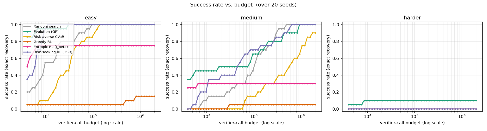

# Layer 0 results — reward = `nrmse`

Same task, same verifier, same budget (2M verifier calls); only the proposer differs. Mean over 20 seeds.

## Best-so-far reward vs. budget

## Batch diversity — the collapse, visualized

## Success rate vs. budget

## Summary (at full budget)

| target | method | success rate | median evals-to-solve | mean best reward |
|---|---|---|---|---|
| easy | Random search | 1.00 | 9300 | 0.9950 |
| easy | Evolution (GP) | 1.00 | 1500 | 0.9950 |
| easy | Risk-averse CVaR | 1.00 | 31500 | 0.9950 |
| easy | Greedy RL | 0.15 | 481200 | 0.8406 |
| easy | Entropic RL (J_beta) | 0.75 | 3800 | 0.9610 |
| easy | Risk-seeking RL (DSR) | 1.00 | 5900 | 0.9950 |
| medium | Random search | 1.00 | 103000 | 0.9939 |
| medium | Evolution (GP) | 1.00 | 46800 | 0.9938 |
| medium | Risk-averse CVaR | 0.90 | 480700 | 0.9858 |
| medium | Greedy RL | 0.05 | 27200 | 0.8290 |
| medium | Entropic RL (J_beta) | 0.30 | 3200 | 0.8750 |
| medium | Risk-seeking RL (DSR) | 1.00 | 45800 | 0.9938 |
| harder | Random search | 0.00 | - | 0.9217 |
| harder | Evolution (GP) | 0.15 | 7800 | 0.9452 |
| harder | Risk-averse CVaR | 0.00 | - | 0.7837 |
| harder | Greedy RL | 0.00 | - | 0.8484 |
| harder | Entropic RL (J_beta) | 0.00 | - | 0.9175 |
| harder | Risk-seeking RL (DSR) | 0.75 | 533000 | 0.9799 |

## Success rate at increasing verifier-call budgets

| target | method | 100k | 200k | 500k | 1M | 2M |
|---|---|---|---|---|---|---|
| easy | Random search | 1.00 | 1.00 | 1.00 | 1.00 | 1.00 |
| easy | Evolution (GP) | 1.00 | 1.00 | 1.00 | 1.00 | 1.00 |
| easy | Risk-averse CVaR | 0.90 | 1.00 | 1.00 | 1.00 | 1.00 |
| easy | Greedy RL | 0.05 | 0.05 | 0.10 | 0.15 | 0.15 |
| easy | Entropic RL (J_beta) | 0.75 | 0.75 | 0.75 | 0.75 | 0.75 |
| easy | Risk-seeking RL (DSR) | 1.00 | 1.00 | 1.00 | 1.00 | 1.00 |
| medium | Random search | 0.50 | 0.75 | 1.00 | 1.00 | 1.00 |
| medium | Evolution (GP) | 0.65 | 0.80 | 0.90 | 1.00 | 1.00 |
| medium | Risk-averse CVaR | 0.15 | 0.30 | 0.50 | 0.70 | 0.90 |
| medium | Greedy RL | 0.05 | 0.05 | 0.05 | 0.05 | 0.05 |
| medium | Entropic RL (J_beta) | 0.30 | 0.30 | 0.30 | 0.30 | 0.30 |
| medium | Risk-seeking RL (DSR) | 0.70 | 0.75 | 0.90 | 1.00 | 1.00 |
| harder | Random search | 0.00 | 0.00 | 0.00 | 0.00 | 0.00 |
| harder | Evolution (GP) | 0.10 | 0.10 | 0.10 | 0.10 | 0.15 |
| harder | Risk-averse CVaR | 0.00 | 0.00 | 0.00 | 0.00 | 0.00 |
| harder | Greedy RL | 0.00 | 0.00 | 0.00 | 0.00 | 0.00 |
| harder | Entropic RL (J_beta) | 0.00 | 0.00 | 0.00 | 0.00 | 0.00 |
| harder | Risk-seeking RL (DSR) | 0.15 | 0.25 | 0.30 | 0.45 | 0.75 |

> **Note (post-fix).** The `harder` rows are from the re-run after the risk-gradient
> normalization fix (the `1/(εN)` scale); before the fix, risk-seeking spuriously read 0.00 on
> `harder`. The fix only affects the risk-seeking / CVaR arms; the `easy` and `medium` rows are
> from the pre-fix run (those targets are already at/near ceiling for every arm and are unchanged
> in practice). A fully consistent single-run sweep of all three targets is queued.
